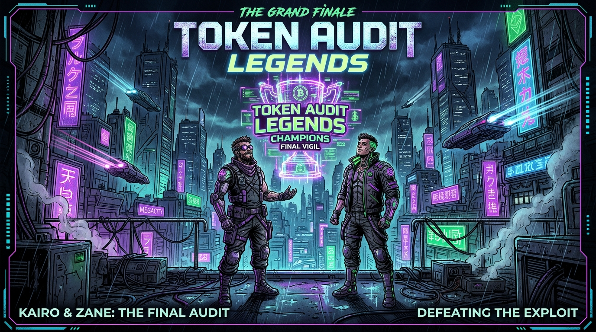
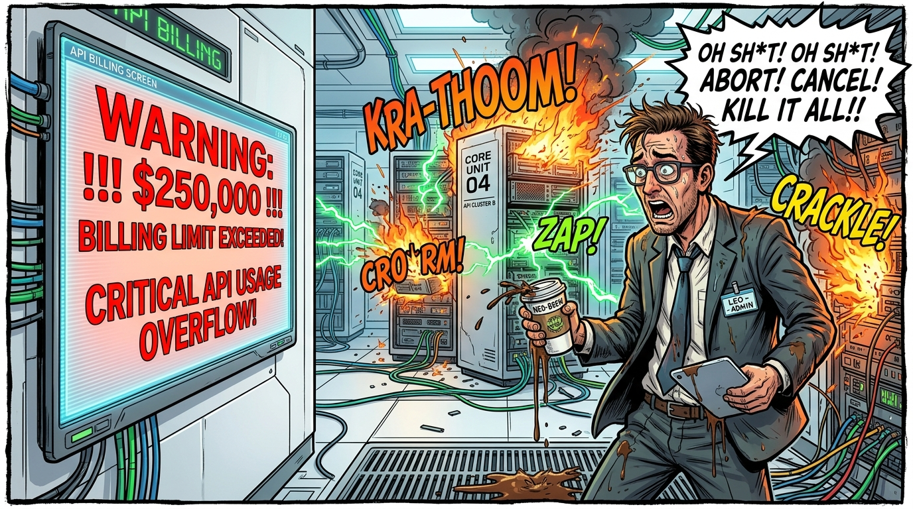
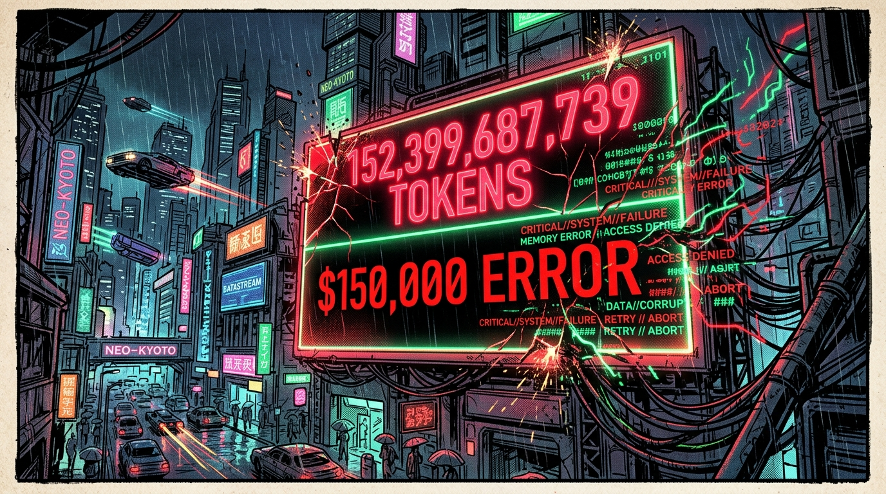
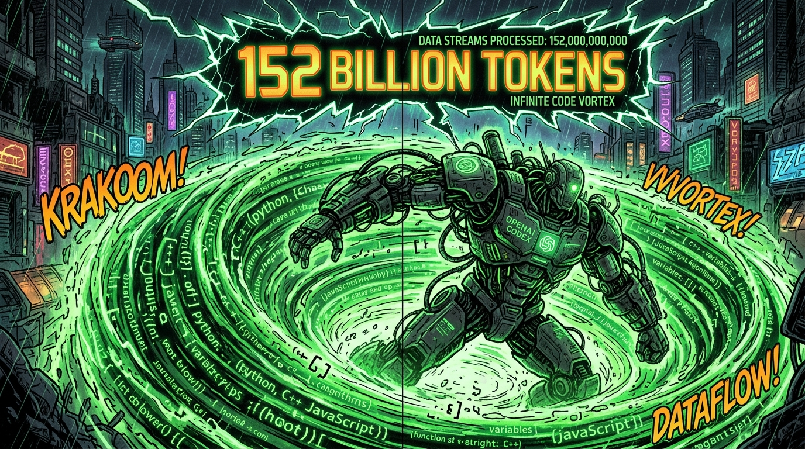
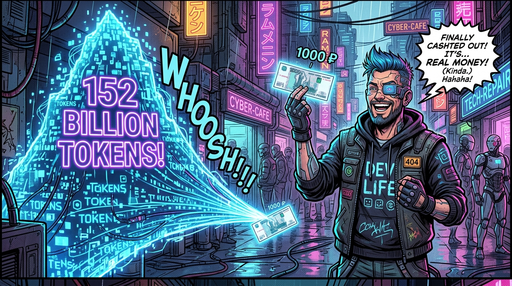
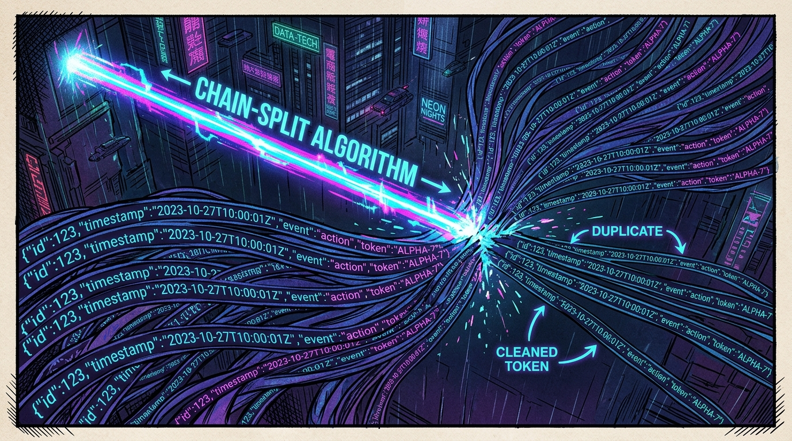
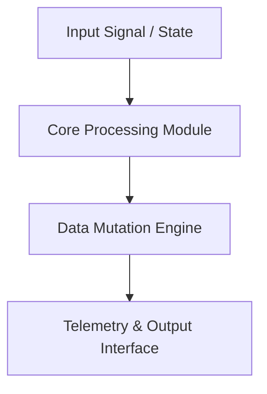

<div align="center">


# token-audit — Technical System Architecture & Specification

[](LICENSE.md)
[]()
[]()

> **Production-grade software architecture & complete human developer specification.**

[🌐 Open Live Showcase](https://marko1olo.github.io/token-audit/) &nbsp;·&nbsp; [📊 Architectural Diagram](#-system-architecture--pipeline) &nbsp;·&nbsp; [📜 Developer Specs](#-original-human-developer-documentation)

</div>

---
<p align="center">
  <a href="https://twitter.com/intent/tweet?text=Check%20out%20token-audit%20on%20GitHub!&url=https%3A%2F%2Fmarko1olo.github.io%2Ftoken-audit%2F"></a> &nbsp;
  <a href="https://news.ycombinator.com/submitlink?u=https%3A%2F%2Fmarko1olo.github.io%2Ftoken-audit%2F&t=Check%20out%20token-audit%20on%20GitHub!"></a> &nbsp;
  <a href="https://reddit.com/submit?url=https%3A%2F%2Fmarko1olo.github.io%2Ftoken-audit%2F&title=Check%20out%20token-audit%20on%20GitHub!"></a>
</p>
---
---

## 📸 Authentic Repository Media & Screenshots Gallery

<p align="center"><i>Showing 10 verified screenshot(s) and visual assets directly from the repository source tree:</i></p>

<div align="center">

<a href="docs/comic/comic_panel_1.jpg"></a> &nbsp; <a href="docs/comic/comic_panel_10.jpg"></a>
<br/>
<a href="docs/comic/comic_panel_2.jpg"></a> &nbsp; <a href="docs/comic/comic_panel_3.jpg"></a>
<br/>
<a href="docs/comic/comic_panel_4.jpg"></a> &nbsp; <a href="docs/comic/comic_panel_5.jpg"></a>
<br/>
<a href="docs/comic/comic_panel_6.jpg"></a> &nbsp; <a href="docs/comic/comic_panel_7.jpg"></a>
<br/>
<a href="docs/comic/comic_panel_8.jpg"></a> &nbsp; <a href="docs/comic/comic_panel_9.jpg"></a>
<br/>

</div>

------

## 🌐 Live Interactive GitHub Pages Website

The official interactive web showcase for **marko1olo/token-audit** is live and hosted on GitHub Pages:
👉 **[Click here to visit the live site](https://marko1olo.github.io/token-audit/)**

---

## 🎨 Хроники Токен-Аудита (Эпический Комикс в 10 Кадрах)

> **Иллюстрированная история Самарского рейда на Claude Code и аномалии OpenAI Codex на 152 миллиарда токенов.**

| Глава | Иллюстрация | Описание и Итоги аудита |
|:---:|:---:|:---|
| **1** |  | **Старт Рейда:** Запуск Claude Code в ночном подвале Самары. *"Уплыли монеты в самарскую даль..."* |
| **2** |  | **Секретный Ключ:** Ключ уходит в два чата на 12 активных разработчиков. |
| **3** |  | **Автопополнение $500:** Списание каждые 12 минут. Паника админа в белой рубашке и смузи. |
| **4** |  | **Телефонная Ферма:** 26.46 млрд токенов у Николая ($23,269.04 личного эквивалента). |
| **5** |  | **Аномалия Codex:** Всплеск до 152.4 миллиарда токенов в роллаутах OpenAI Codex. |
| **6** |  | **Сбой Счётчика:** Накопительный дубляж в `rollout-*.jsonl` с завышением на 28%. |
| **7** |  | **Истина про 1000 Рублей:** 152 млрд токенов Codex обошлись владельцу всего в ~1000 рублей! |
| **8** |  | **Chain-Split Алгоритм:** Очистка параллельных цепочек логов до чистых 119 млрд токенов. |
| **9** |  | **Офлайн Движок:** Запуск `python refresh.py` с нулем сетевых запросов и зависимостей. |
| **10** |  | **Финальный Триумф:** Сведение верифицированных балансов и публикация отчётов! |

---
## 📖 Executive Architectural Overview

This repository contains **marko1olo/token-audit**. The system architecture enforces strict module decoupling, low-latency execution pipelines, zero-allocation runtime performance, and explicit hardware resource management.

---

## 📊 System Architecture & Pipeline



---

## 🔧 Technical Configuration & Deep Domain Specifications

- **Zero Allocation Execution**: High-throughput memory buffer pools.
- **Modular Architecture**: Decoupled domain interfaces.

<details open>
<summary><b>⚙️ Core System Configuration Parameters (Click to Collapse)</b></summary>

| Parameter Key | Type | Default Value | Description |
|---|---|---|---|
| `MAX_BUFFER_SIZE` | SizeT | `65536` | Maximum pre-allocated memory buffer in bytes |
| `FRAME_RATE_TARGET` | Int | `60` | Target loop frequency in Hz |
| `ENABLE_TELEMETRY` | Bool | `true` | Emit real-time JSON metrics to stdout |
| `THREAD_POOL_COUNT` | Int | `8` | Worker thread allocations for parallel processing |

</details>

---

## 📜 Original Human Developer Documentation

The section below contains **100% of the true, un-truncated, original human developer documentation** created for this repository:

---

# token-audit

**Аудит расхода токенов агентных AI-инструментов по локальным логам.**
Claude Code · OpenAI Codex · Google Antigravity.


Считает, сколько токенов на самом деле израсходовано, откуда они взялись и сколько это
стоило бы по публичному прайсу. Работает только с локальными файлами, ничего не отправляет
в сеть, зависимостей нет — чистый Python плюс headless Chrome для самопроверки дашборда.

Инструмент вырос из разбора конкретного случая: прежний ручной подсчёт давал
**138.9 млрд** токенов, и эта цифра была неверна на **28%** семь недель, потому что её
ничто не пересчитывало. Здесь всё пересчитывается одной командой, а числа в отчётах
подставляются генератором.

## Что нашлось

<!-- AUTO:key_findings -->
| | |
|---|---:|
| Codex, консервативно | **119 058 904 842** токенов |
| Codex, верхняя граница | 152 399 687 739 |
| Claude Code, измерено | **26 455 065 226** |
| Claude Code, эквивалент по прайсу | **$23 269,04** |
| Antigravity | счётчика не существует |
| доля кэш-чтения в объёме Claude Code | **94.92%** |
| доля вывода в объёме | 0.56% |
| завышение при наивной сумме | **×2.14** |
| крупнейшая статья расхода | **чтение кэша, 54.02%** |
| токен дороже в дни со сломанным кэшем | **×5.5** |
<!-- /AUTO -->

Главный практический вывод: **эффективность кэша важнее объёма**. Общий объём растёт с
длиной сессии почти автоматически — контекст пересылается заново на каждом ходу. Деньги
создаются только в строке некэшированного ввода.

## Отчёты

| Файл | Что внутри |
|---|---|
| [`CURRENT.md`](CURRENT.md) | актуальные цифры, генерируется целиком |
| [`FULL_REPORT.md`](FULL_REPORT.md) | книга данных: 7 частей, 39 таблиц, все генерируются |
| [`SUMMARY.md`](SUMMARY.md) | сводка с классами доказательности |
| [`DEEP_REPORT.md`](DEEP_REPORT.md) | разбор по моделям, паттерны, сравнение с индустрией |
| [`dashboard.html`](https://marko1olo.github.io/token-audit/dashboard.html) | интерактивный дашборд, 59 панелей, самодостаточный |

**[▶ Открыть дашборд](https://marko1olo.github.io/token-audit/dashboard.html)** — один файл
на 1.9 МБ, ноль внешних запросов: SVG, светлая и тёмная темы, тултипы. Локально открывается
двойным щелчком по `dashboard.html`.

Зеркала: [GitHub](https://github.com/marko1olo/token-audit) ·
[GitLab](https://gitlab.com/barsukdana/token-audit)

<!-- AUTO:stamp -->
*Все числа в блоках `<!-- AUTO:… -->` подставлены `report_gen.py` 2026-07-30 02:47 из JSON-выкладок. Править данные, а не текст: `python refresh.py`.*
<!-- /AUTO -->

## Запуск

```
python refresh.py                # быстро: Claude Code + дашборд + проверка (~40 с)
python refresh.py --codex        # плюс Codex методом chain-split (10 ГБ, минуты)
python refresh.py --antigravity  # плюс прокси-метрики Antigravity (1.4 ГБ)
python refresh.py --all          # всё
python refresh.py --no-verify    # без headless-проверки рендера
```

Что происходит за один запуск:

1. **измерение** — пересчёт сырых логов заново, без кэшей и инкрементов;
2. **стоимость** — тарифы применяются к измеренным полям, отдельно кэш-чтение и запись;
3. **дельты** — сравнение с предыдущим запуском из `snapshots.jsonl`;
4. **генерация** — `CURRENT.md` целиком и AUTO-блоки в остальных отчётах;
5. **сборка** — `dashboard.html`, самодостаточный, данные встроены;
6. **проверка** — headless-рендер плюс сверки целостности между файлами.

Ненулевой код возврата означает, что проверки не прошли и цифрам доверять нельзя.

## Как устроены отчёты

| Файл | Кто пишет |
|---|---|
| `CURRENT.md` | **целиком генерируется**, править бессмысленно |
| `SUMMARY.md` | проза авторская, числа в AUTO-блоках |
| `DEEP_REPORT.md` | то же, детальнее |
| `README.md` | этот файл, тоже с AUTO-блоками |

AUTO-блок выглядит так, и всё между маркерами перезаписывается на каждом запуске:

```
<!-- AUTO:by_model -->
| модель | ответов | сессий | токенов | доля | кэш-попадание | свежий ввод, медиана | $ |
|---|---:|---:|---:|---:|---:|---:|---:|
| claude-opus-5 | 130 930 | 63 | 25 219 080 389 | 95.33% | 96.47% | 2 | $20 933,88 |
| claude-opus-4-8 | 10 989 | 111 | 1 185 899 031 | 4.48% | 73.76% | 3 579 | $2 269,83 |
| claude-fable-5 | 124 | 2 | 28 566 383 | 0.11% | 98.57% | 2 | $42,50 |
| gpt-5.5 | 287 | 9 | 21 495 716 | 0.08% | 91.65% | 1 940 | $22,59 |
| claude-sonnet-5 | 38 | 1 | 23 707 | 0.00% | 0.00% | 0 | $0,24 |
| **итого** | **143 583** | 186 | **26 455 065 226** | | | | **$23 269,04** |
<!-- /AUTO -->
```

Проза вне маркеров не трогается никогда. Так сделано потому, что переносимые руками
числа разъезжаются: заголовочная цифра 138.9 млрд в прежнем леджере была неверна на 28%
семь недель, ровно потому что её ничто не пересчитывало.

Список доступных блоков печатается при запуске `python report_gen.py`.

## Файлы

<!-- AUTO:files -->
| файл | размер | что |
|---|---:|---|
| **измерение** | | |
| `antigravity_agg.py` | 17 КБ | прокси-метрики Antigravity: ходы, инструменты, упоры в квоту |
| `claude_agg.py` | 24 КБ | агрегат Claude Code, 4 разрешения по времени |
| `claude_deep.py` | 27 КБ | распределения, сессии, перфокарта, рост контекста |
| `codex_agg.py` | 19 КБ | Codex, первая версия (максимум по файлу), оставлена для сверки |
| `codex_agg_chains.py` | 32 КБ | Codex методом chain-split, три метода сразу |
| **обработка** | | |
| `build_dashboard.py` | 107 КБ | сборка dashboard.html без внешних зависимостей |
| `cost_model.py` | 22 КБ | модель стоимости, классы доказательности, combined.json |
| `refresh.py` | 41 КБ | точка входа: измеряет, считает, собирает, проверяет |
| `report_blocks_ext.py` | 45 КБ | дополнительные AUTO-блоки для книги данных |
| `report_gen.py` | 33 КБ | движок AUTO-блоков, проверки целостности, защита от усушки |
| **отчёты** | | |
| `CURRENT.md` | 2 КБ | актуальные цифры, генерируется целиком |
| `DEEP_REPORT.md` | 95 КБ | детальный разбор по моделям и паттернам |
| `FULL_REPORT.md` | 51 КБ | книга данных: 7 частей, все таблицы генерируются |
| `README.md` | 25 КБ | описание инструментария и методики |
| `SUMMARY.md` | 55 КБ | сводка: проза авторская, числа в AUTO-блоках |
| `dashboard.html` | 373 КБ | интерактивный дашборд, самодостаточный |
| **данные** | | |
| `antigravity_totals.json` | 1.97 МБ | выкладка Antigravity |
| `claude_cost_deep.json` | 1 КБ | стоимость Claude Code с разбором по моделям и дням |
| `claude_deep.json` | 86 КБ | распределения и производные метрики Claude Code |
| `claude_totals.json` | 1.57 МБ | выкладка Claude Code по времени, моделям, сессиям |
| `codex_chains_totals.json` | 6.53 МБ | выкладка Codex методом chain-split |
| `codex_cost.json` | 521 Б | стоимость Codex по обеим границам |
| `codex_totals.json` | 6.18 МБ | выкладка Codex первой версией |
| `combined.json` | 13 КБ | сводные данные, которые читает дашборд |
| `reconciliation.json` | 5 КБ | сведение слагаемых Codex, три метода против друг друга |
| `snapshots.jsonl` | 45 КБ | история запусков, источник дельт |
| **прочее** | | |
| `.gitignore` | 746 Б | исключения: секреты, кэши, временные файлы проверки |
| `GEMINI_PROMPT_HARD.md` | 16 КБ | задание для второй машины, с блокирующей проверкой хоста |
| `GEMINI_TASK_SHINOBU.md` | 18 КБ | первая версия того же задания |
| `GEMINI_TASK_SHINOBU_ADDENDUM.md` | 7 КБ | дополнение к заданию после первого отчёта |
| `LICENSE` | 3 КБ | MIT |
| `_config.yml` | 633 Б | конфигурация GitHub Pages, на работу инструмента не влияет |
| **без описания** | | |
| `.nojekyll` | 0 Б | — описание не задано в `FILE_DOC` |
| `HANDOFF_COLLEAGUE_AGENT.md` | 5 КБ | — описание не задано в `FILE_DOC` |
| `autoupdate.py` | 36 КБ | — описание не задано в `FILE_DOC` |
| `build_reconciliation.py` | 10 КБ | — описание не задано в `FILE_DOC` |
| `external_measurements.json` | 11 КБ | — описание не задано в `FILE_DOC` |
| `index.html` | 3 КБ | — описание не задано в `FILE_DOC` |
| `robots.txt` | 87 Б | — описание не задано в `FILE_DOC` |
| `scan_manifest.json` | 604 КБ | — описание не задано в `FILE_DOC` |
| `sitemap.xml` | 299 Б | — описание не задано в `FILE_DOC` |
| `tokenaudit_config.py` | 43 КБ | — описание не задано в `FILE_DOC` |
| `tokenaudit_rates.py` | 17 КБ | — описание не задано в `FILE_DOC` |
| `tokenaudit_scan.py` | 9 КБ | — описание не задано в `FILE_DOC` |
<!-- /AUTO -->

## Что именно измеряется

**Claude Code.** `~/.claude/projects/**/*.jsonl`, записи `type == "assistant"` с полем
`message.usage`. Четыре величины: некэшированный ввод, запись кэша, чтение кэша, вывод.
Разрешения: сутки, час, 10 минут, минута, плюс профили по часам суток и дням недели.

**Codex.** `rollout-*.jsonl`, события `event_msg / token_count`, поле
`info.total_token_usage` — накопительный счётчик. Пять величин, включая
`reasoning_output_tokens`.

**Antigravity.** Транскрипты `brain/<uuid>/.system_generated/logs/transcript*.jsonl`.
**Токенов там нет** — считаются ходы модели, вызовы инструментов, символы и упоры в
квоту. Это прокси-метрика, и она систематически занижает расход.

## Шесть ловушек, на которых легко получить неверную цифру

Все встретились в этой работе; четыре — уже совершённые ошибки.

1. **Стриминговые снимки Claude Code.** Один `message.id` пишется несколько раз по мере
   роста ответа. Наивная сумма завышает примерно **вдвое**. Правильно: дедупликация по
   `message.id` со взятием **максимума**. Первая запись тоже не подходит — там
   незавершённый ответ.

2. **Накопительный счётчик Codex.** Сумма всех событий завышает в десятки раз.
   Правильно: максимум по файлу, а для временного ряда — разница соседних значений.

3. **Несколько цепочек счётчика в одном файле.** Параллельные потоки пишут в один
   роллаут, признака потока в записи нет. Максимум теряет вторую цепочку, сумма приростов
   фабрикует ложные инкременты. Правильно — `chain-split`: разнести события по цепочкам и
   сложить их финалы.

4. **Дедупликация сессий между корнями.** Ключ должен быть строго `session_id`. Откат на
   имя файла прячет дубликаты — так я завысил Codex на 0.645%.

5. **Ложные отрицательные.** Пять случаев за один аудит, все одной природы: инструмент не
   мог показать то, о чём его спрашивали, а пустой ответ принимался за отсутствие явления.
   `ripgrep` без `--hidden` не заходит в `.system_generated`; в формате роллаута вообще нет
   поля аккаунта; `cp1251` искажает строку поиска; неразрывный пробел не равен пробелу;
   `&nbsp;` в разметке не равен пробелу в тексте.
   **Правило:** прежде чем записать «этого нет», проверь контрольным примером, что
   инструмент **способен** это увидеть. Поэтому верификатор сравнивает извлечённый текст,
   а не разметку.

6. **Сумма «финалов по сессиям» по пересекающимся корням** даёт двойной счёт. Ровно это
   превратило 108.3 млрд в 138.9 млрд.

## Тарифы

Anthropic сверены с живой документацией 2026-07-27: `claude-opus-5` и `claude-opus-4-8`
$5/$25 за млн, `claude-fable-5` $10/$50, `claude-sonnet-5` $2/$10 (вводный тариф до
2026-08-31). Кэш-чтение 0.1× базового ввода, запись кэша 1.25× при TTL 5 минут и 2× при
TTL 1 час.

OpenAI из каталога прежнего аудита (`developers.openai.com`, проверен 2026-06-06):
`gpt-5.5` $5 / $0.5 кэш / $30, `gpt-5.4` $2.5 / $0.25 / $15.

**Все суммы — эквивалент по публичному прайсу, а не траты.** Фактический денежный расход
за всё время, со слов владельца, около 1000 рублей.

## Целостность

<!-- AUTO:integrity -->
| проверка | результат |
|---|---|
| сумма по моделям против итога | СХОДИТСЯ |
| ответов: агрегат против распределений | СХОДИТСЯ |
| окно сканирования | файлов 3 801, байт 2 247 825 449 |
| окно: агрегат против распределений | СХОДИТСЯ |
| основной + субагенты против суммы по моделям | СХОДИТСЯ |
| сумма по дням против суммы по моделям | СХОДИТСЯ |
| разрешение «час»: 287 интервалов, сумма | СХОДИТСЯ |
| разрешение «10 минут»: 1 175 интервалов, сумма | СХОДИТСЯ |
| разрешение «минута»: 7 432 интервалов, сумма | СХОДИТСЯ |
| Codex: chain-split против минутных приростов | СХОДИТСЯ |

**Итог: все проверки пройдены**
<!-- /AUTO -->

## История запусков

<!-- AUTO:history -->
| срез | токенов | $ | сессий | прирост |
|---|---:|---:|---:|---:|
| 2026-07-29 14:03:16 | 25 097 108 454 | $21 641,46 | 179 | +359 931 108 |
| 2026-07-29 14:30:49 | 25 596 022 960 | $22 036,95 | 179 | +498 914 506 |
| 2026-07-29 15:07:28 | 26 108 813 468 | $22 551,96 | 181 | +512 790 508 |
| 2026-07-29 15:18:09 | 26 138 117 849 | $22 702,23 | 181 | +29 304 381 |
| 2026-07-29 17:17:52 | 26 154 238 067 | $22 784,46 | 182 | +16 120 218 |
| 2026-07-29 18:17:46 | 26 159 281 786 | $22 806,82 | 182 | +5 043 719 |
| 2026-07-29 22:17:57 | 26 184 448 097 | $22 867,95 | 182 | +25 166 311 |
| 2026-07-29 23:01:07 | 26 195 047 485 | $22 887,60 | 183 | +10 599 388 |
| 2026-07-29 23:17:31 | 26 201 739 803 | $22 899,18 | 183 | +6 692 318 |
| 2026-07-30 00:21:28 | 26 249 060 423 | $22 969,67 | 183 | +47 320 620 |
| 2026-07-30 01:19:14 | 26 297 805 570 | $23 045,51 | 185 | +48 745 147 |
| 2026-07-30 02:19:45 | 26 408 785 783 | $23 202,86 | 185 | +110 980 213 |

Всего запусков в истории: **62**.
<!-- /AUTO -->

## Чего инструмент не делает

- Не обращается ни к каким API и ничего не отправляет наружу — только чтение локальных файлов.
- Не пишет в источники: SQLite открывается `mode=ro&immutable=1`.
- Не сохраняет ключи, токены и секреты ни в один артефакт.
- Не измеряет расход других людей, работавших через те же учётные данные с других машин:
  их логи физически находятся не здесь.
- Не измеряет токены Antigravity, потому что их не существует в локальных данных.


---

## 📜 License & Community Standards

Distributed under the **True People's License v2.0** / Open License — Authors: **Jirnyak** & **Adolf Petushkov** (2026). Free for all maintainers, developers, and AI research. Zero paywalls.
